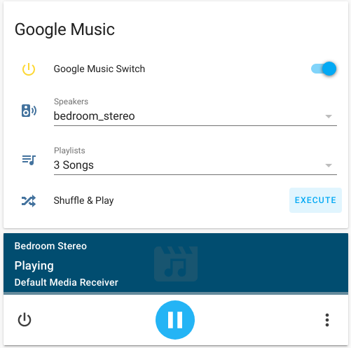
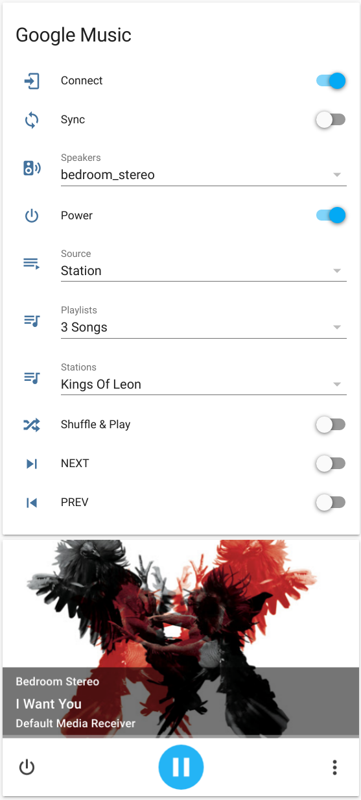

## Google Music in Home Assistant
Stream from your [Google Music library](https://play.google.com/music/listen#/home) with Home Assistant

### Google Music in HA -- [Custom Component](https://community.home-assistant.io/t/google-music-in-ha/10976/214?u=troy)
I fear recent changes in Home Assistant may eventually break this.  
Updated version of the original [Google Music custom component](https://community.home-assistant.io/t/google-music-in-ha/10976?u=troy) to work with Home Assistant 92.1+  

### Google Music in HA -- [Using AppDaemon](https://community.home-assistant.io/t/google-music-in-ha-using-appdaemon/109983?u=troy)
In the future, I hope to contribute toward creating a new Google Music component for Home Assistant.  
For now I have found [AppDaemon](https://www.home-assistant.io/docs/ecosystem/appdaemon) to be an easier approach to start learning python and the [gmusicapi](https://github.com/simon-weber/gmusicapi).  

