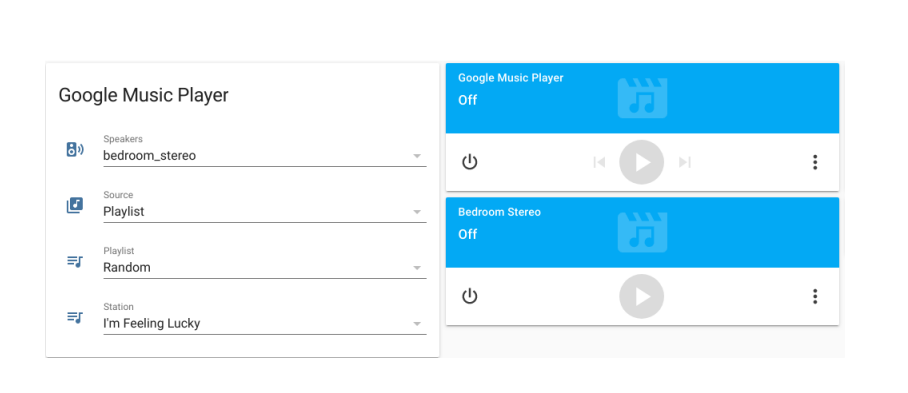
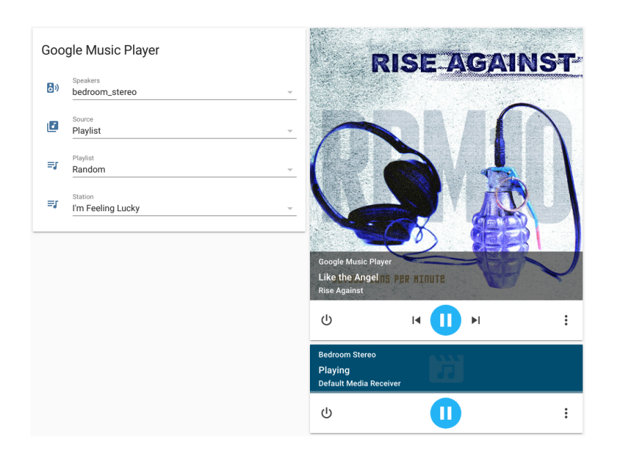

:warning: Do not install this component

[Google Music will be completely shutdown by December 2020](https://9to5google.com/2020/08/04/google-play-music-shutdown/)

This component will stop working at that time.

---

## Google Music Media Player

**Based on [the original gmusic in HA code](https://github.com/Danielhiversen/home-assistant_config/blob/master/custom_components/switch/gmusic.py) by @Danielhiversen**  

I can sum it up like this. There's the *right way* and there's the *get it done* way. This is a *get it done* way.  
*While this is not  perfect custom component, it does seem to work rather well so far.*


**Not perfect -** There’s a few things that are simple to do with appdaemon or even a yaml script that I haven't got to work *as needed* from inside the custom component itself. Two things I’m using workarounds for are auto-play when powered on and auto-track advance. Auto-play is handled by a yaml script. The auto-track advance is also a yaml script that is being triggered based on an included template sensor. Fortunately in these cases, as mentioned, a few yaml scripts added to the configuration package file do provide a quick and seemingly efficiet workaround. *These have already been included. They can remain hidden and should require no interaction on your part.*

**Otherwise -** The setup and function is much like the original gmusic switch. Additionally, this adds most of the media_player services, the ablilty to play stations you have added to your music library and an option to use oauth-login for the gmusicapi. This still uses additional input_select(s) and media_play entities as the original switch does. From the input_select(s), your media_player (I call speakers) is selected when the power is turned on. (You have to toggle power off/on if you want to change speakers.) A playlist or station is selected when you press play or use `media_player.media_play` from an 'idle' or 'stopped' state. Selected tracks are loaded to the track queue (I refer to track queue as the loaded/playing music.) and begin to play. This means stop/play can be used to change music without powering off the speakers but pause/play is still pause and play.  

---
#### Install with HACS (Home Assistant Community Store)

[](https://github.com/custom-components/hacs)

You can use [HACS](https://github.com/custom-components/hacs#hacs-home-assistant-community-store) to install and update this custom component for you.  
In HACS Settings --> Custom Repositories, add the following:
    
    https://github.com/tprelog/homeassistant-gmusic_player

Use type: `Integration`

#### Install Manually
Inside your Home Assistant `custom_components` directory, create another named `gmusic_player`  

Add the following files to `custom_components/gmusic_player`:  
*The first two files should only contain a single comment on the first line*  
[`custom_components/gmusic_player/__init__.py`](https://github.com/tprelog/homeassistant-gmusic_player/blob/master/custom_components/gmusic_player/__init__.py)  
[`custom_components/gmusic_player/services.yaml`](https://github.com/tprelog/homeassistant-gmusic_player/blob/master/custom_components/gmusic_player/services.yaml)  
[`custom_components/gmusic_player/manifest.json`](https://github.com/tprelog/homeassistant-gmusic_player/blob/master/custom_components/gmusic_player/manifest.json)  
[`custom_components/gmusic_player/media_player.py`](https://github.com/tprelog/homeassistant-gmusic_player/blob/master/custom_components/gmusic_player/media_player.py)  

---
### Configuration after Install
- Everything for the configuration is provided using packages.
- You should only need to edit a few things to get this up and running.
- If you have never used a packages file [SEE HERE.](https://www.home-assistant.io/docs/configuration/packages/#create-a-packages-folder)  

**Add both of the following files to your Home Assistant `packages` directory**  
 - [`packages/gmusic_config.yaml`](https://github.com/tprelog/homeassistant-gmusic_player/blob/master/packages/gmusic_config.yaml)
 - [`packages/gmusic_player.yaml`](https://github.com/tprelog/homeassistant-gmusic_player/blob/master/packages/gmusic_player.yaml)

---
### Configuration options:  `packages/gmusic_config.yaml`

Key | Type | Required | Description
--- | --- | --- | ---
`username` | `string` | `YES` | Set your google music username.
`password` | `string` | `YES` | Set your google music password.
`device_id`| `string` | `YES` | Set your valid device_id here.
`token_path` | `string` | `NO` | Directory with RW access for `gmusic_authtoken`
`gmusicproxy` | `string` | `NO` | Url for your local gmusic proxy server 
`shuffle` | `boolean` | `NO` | Default: `True`
`shuffle_mode` | `integer` | `NO` | Default: `1`

### You also need to configure your media_players here
 - At the bottom, edit the example media_players so they match your own

```yaml
    speakers: # Example media_players
    - bedroom_stereo
    - workshop_stereo
```

---
### Select and play music
 In similiar function to the original gmusic switch, you could choose your media player and playlist (or station), when you turn on the gmusic_player the selected music will play to the selected speakers. To change the speakers and playlist, you could make new selections and toggle power using the button on the gmusic_player or using media_player services `media_player.turn_off` then `media_player.turn_on`. Basically the same way the switch works. `media_player.toggle` can be used to control power as well.



`media_player.media_play`  
When you press play on gmusic_player from an 'idle' or 'stopped' state, it will (re)load whatever playlist or station you have selected.
*Depending on the selected source*

`media_player.media_play_pause`  
Or when you press play on gmusic_player from a'playing' or 'paused' state. Toggle play/pause.
*This is the default media_player action.*

`media_player.media_stop`  
If you just want to reload or change the playlist you can stop (not pause) the music.
*For gmusic_player you only need to toggle power if you want to change the speakers.*

`media_player.media_pause`  
Just pause. Does not toggle back to play

`media_player.play_media`  
Straight up play some music! Important thing here is to first select your speakers.

This is intended to work in the following manner:
- If gmusic_player is off this will turn it on and the selected playlist or station will play.
- If gmusic_player is already playing this will stop whatever is playing and the selected playlist or station will play.
- It will change the respective input_selects to match the play back options.

The `entity_id` will always be `media_player.gmusic_player`.  
For gmusic_player valid `media_content_type` are `playlist` or `station`.  
`media_content_id` is an option from the respective input_select.  

For example on the services page I could use this to start playing a 'playlist' named "3 Songs".
```
{
"entity_id": "media_player.gmusic_player",
"media_content_type": "playlist",
"media_content_id": "3 Songs"
}
```
This would immediately switch to (or start) playing a 'station' named "'90s Alternative Rock"
```
{
"entity_id": "media_player.gmusic_player",
"media_content_type": "station",
"media_content_id": "'90s Alternative Rock"
}
```

 `media_player.media_previous_track`  
Or when you press prev on gmusic_player, will play the previous track (not start the current track over)  
*unless shuffle_mode = 2 or 3*

`media_player.media_next_track`  
Or when you press next on gmusic_player, will play the next track

`media_player.volume_set`  
Use 2 digit float from 0 - 1. *100%* volume is *1*

For example on the services page to set volume at 8% use `0.08`:
```
{
  "entity_id": "media_player.gmusic_player",
  "volume_level": 0.08
}
```
 To set 35% volume use `0.35`:
```
{
  "entity_id": "media_player.gmusic_player",
  "volume_level": 0.35
}
```

`media_player.volume_down`  
Or when you press volume down on gmusic_player  
Decrease volume by 5% increments until 1%.  
*Use volume_mute or set_volume to 0 for no sound.*

`media_player.volume_up`  
Or when you press volume up on gmusic_player  
Increase volume by 5% increments.

`media_player.volume_mute`  
Or when you press mute on gmusic_player  
Toggles mute on/off.

`media_player.shuffle_set`  
This accepts a boolean so you can only turn shuffle off/on. Tracks are shuffled when the playlist is loaded.  
Default is *True* and *shuffle_mode: 1* so playback is similar to the switch. You'll need to reload the playlist (stop/play) for this to take effect.

To turn off shuffle from the services page:
```
{
  "entity_id": "media_player.gmusic_player",
  "shuffle": False
}
```

**Shuffle Mode**   
This can only be set in the package configuration file which means for now having to reboot in order to change this.  
*In the future this will be `media_player.select_sound_mode` or a custom service.*
I'll use the term "track queue" to refer to the list playing songs. This could be a "playlist" or a "station" from your music library.  There are three modes:  

`shuffle_mode: 1` - Shuffle (Default setting)  
This is the default. Tracks are shuffled first then load to the "track queue"
The shuffled queue is played in order from top to bottom. Songs only repeat when the queue has reached the end and starts over.  

`shuffle_mode: 2` - Random  
This loads the playlist songs is the same order they are saved in your library. Tracks are then randomly selected from anywhere in the queue. *Since the queue itself is not being reordered, turning shuffle off/on has immediate effect.* The downside here is when playing queues with small numbers of tracks it can seem like the same songs always repeat while others hardly get played.  

`shuffle_mode: 3` - Shuffle Random  
Tracks are shuffled first then load to the "track queue". Tracks are then randomly selected from anywhere in the queue.  
